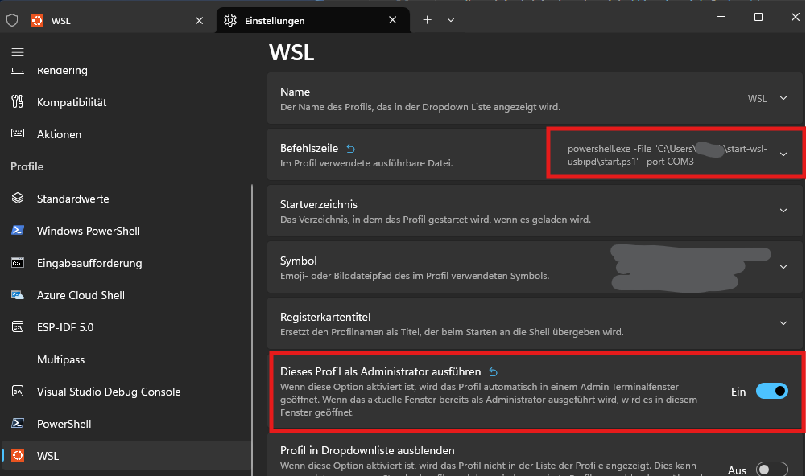

# start-wsl-usbipd
A PowerShell script, which starts the WSL and automatically attaches a passed COM port (if present) with usbipd to WSL.
A Background process is started, that runs every 2 seconds and automatically reattaches the device, if it restarted or 
is physically replugged. It starts the 'default' WSL machine (also opens up tmux within WSL).

## Prerequisites
- WSL
- [usbipd](https://github.com/dorssel/usbipd-win)
- Adapt PowerShell execution policy, to allow running locally created scripts, execute the follwing in PowerShell:
    ```ps
        Set-ExecutionPolicy RemoteSigned -Scope CurrentUser
    ```

## Usage
You need to change the WSL start command (#Step5 in the script, line 53) if you don't have tmux installed 
within WSL (or don't want it to be opened). Also change the command, if you don't like to start the 'default' WSL
 machine.

Script has to be executed within an admin PowerShell. I added it within the Windows Terminal app as a profile,
to automatically execute when I open the terminal, see my configuration in the following picture:



As shown in the picture, COM3 is passed here to WSL.

Of course it is also possible to start the script in some other way, or adapt it for querying the user if and 
which COM port should be attached.

If you like to use the device on the respective COM port on your host machine, simply 'clean' exit WSL (meaning 
executing `exit`).
